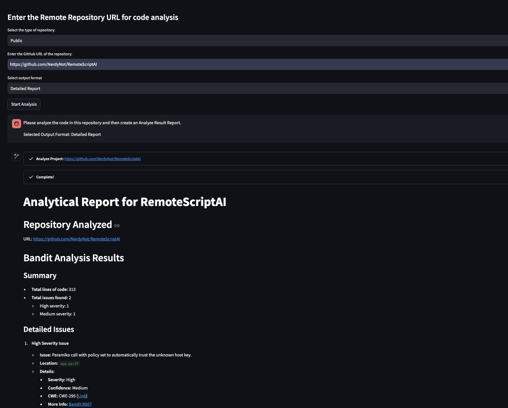

# Code Analyzer AI

- [English Version](#english-version)
- [한국어 버전](#한국어-버전)

---

## English Version

This project provides a tool to analyze code from a GitHub remote repository, generating a report using the LangChain Agent. It utilizes tools such as `HoruSec`, `Bandit`, `pycodestyle`, and `sqlcheck` to perform the analysis and generate results.



## Features

- Easily analyze code by entering a GitHub repository URL.
- Generate readable reports using LLM for otherwise hard-to-read analysis results.
- Embed analysis results into vectors and generate reports based on these vectors.
- Provides features for `Python Code Analysis`, `SQL Analysis`, and `Security Vulnerability Analysis`.
  - `Python Code Analysis` analyzes Python code using `Bandit` and `pycodestyle`.
  - `SQL Analysis` analyzes SQL code using `sqlcheck`.
  - `Security Vulnerability Analysis` analyzes vulnerabilities in various code languages using `Horusec`.

## Requirements

- Docker
- Docker Compose

## Setup

1. Clone the repository:

    ```sh
    git clone https://github.com/yourusername/code-analyzer-ai.git
    cd code-analyzer-ai
    ```

2. Set the environment variables in the `docker-compose.yml` file:

    ```yaml
    version: '3.8'

    services:
      analyzer:
        build: .
        ports:
          - "8501:8501"
        environment:
          # Set the LLM provider (e.g., 'azure', 'openai', 'gemini', 'vertexai', 'anthropic')
          - LLM_PROVIDER=your_llm_provider
          # Set the API key for the chosen LLM provider
          - LLM_API_KEY=your_llm_api_key
          # Set the model name for the chosen LLM provider
          - LLM_MODEL=your_llm_model
          # Set the temperature for the model's response generation
          - LLM_TEMPERATURE=0.5
          # Set the Azure endpoint if the LLM provider is 'azure'
          - AZURE_ENDPOINT=your_azure_llm_endpoint
          # Set the Azure API version if the LLM provider is 'azure'
          - AZURE_API_VERSION=your_azure_api_version
          # Set the Embedding provider (e.g., 'azure', 'openai', 'gemini', 'vertexai')
          - EMBEDDING_PROVIDER=your_embedding_provider
          # Set the API key for the chosen Embedding provider
          - EMBEDDING_API_KEY=your_embedding_api_key
          # Set the model name for the chosen Embedding provider
          - EMBEDDING_MODEL=your_embedding_model
        volumes:
          - .:/app
    ```

3. Build and run the Docker container using Docker Compose:

    ```sh
    docker-compose up -d --build
    ```

4. Open the Streamlit application in your web browser at `http://localhost:8501`.

## Dependencies

Please refer to the [DEPENDENCIES.md](DEPENDENCIES.md) file.

## Usage

1. Enter the details required for code analysis in the Streamlit app:
   - Select the type of repository (Public/Private).
   - Enter the GitHub repository URL.
   - If the repository is private, enter your GitHub Personal Access Token (PAT).
   - Enter the directory path within the repository (leave empty for root).
   - Select the output format (Detailed Report, Simpled Report, JSON).
   - Select the output language (English, Korean).
   - Select the analysis tool (Python Code Analysis, SQL Analysis, Security Vulnerability Analysis).

2. Click "Start Analysis" to analyze the code and generate the report.

## License

This project is licensed under the MIT License.

---

## 한국어 버전

이 프로젝트는 깃허브 원격 저장소의 코드들을 내려받아 코드를 분석 한 후 해당 결과를 LangChain Agent를 이용해 결과 보고서를 생성합니다.
`HoruSec`, `Bandit`, `pycodestyle`, `sqlcheck` 도구를 사용하여 코드를 분석하고 결과를 생성합니다.


## 특징 및 기능
- 간편하게 GitHub 저장소 URL을 입력하여 코드를 분석할 수 있습니다.
- 가독성이 떨어지는 분석 결과를 LLM에 의해 보고서 형태로 생성합니다.
- 분석 결과는 Embedding 처리되어 Vector 형태로 저장되며, 이를 이용하여 결과 보고서를 생성합니다.
- `Python Code Analysis`, `SQL Analysis`, `Security Vulnerability Analysis` 기능을 제공합니다.
    - `Python Code Analysis` 기능은 Python Code를 분석하기 위한 기능으로 `Bandit`, `pycodestyle` 도구를 사용하여 보고서를 생성합니다.
    - `SQL Analysis` 기능은 SQL Code를 분석하기 위한 기능으로 `sqlcheck` 도구를 사용하여 보고서를 생성합니다.
    - `Security Vulnerability Analysis` 기능은 여러 코드 언어의 취약점을 분석하기 위한 기능으로 `Horusec` 도구를 사용하여 보고서를 생성합니다.

## 요구 사항

- Docker
- Docker Compose

## 설정

1. 저장소를 복제합니다:

    ```sh
    git clone https://github.com/yourusername/code-analyzer-ai.git
    cd code-analyzer-ai
    ```

2. `docker-compose.yml` 파일에서 환경 변수를 설정합니다:

    ```yaml
    version: '3.8'

    services:
      analyzer:
        build: .
        ports:
          - "8501:8501"
        environment:
          # Set the LLM provider (e.g., 'azure', 'openai', 'gemini', 'vertexai', 'anthropic')
          - LLM_PROVIDER=your_llm_provider
          # Set the API key for the chosen LLM provider
          - LLM_API_KEY=your_llm_api_key
          # Set the model name for the chosen LLM provider
          - LLM_MODEL=your_llm_model
          # Set the temperature for the model's response generation
          - LLM_TEMPERATURE=0.5
          # Set the Azure endpoint if the LLM provider is 'azure'
          - AZURE_ENDPOINT=your_azure_llm_endpoint
          # Set the Azure API version if the LLM provider is 'azure'
          - AZURE_API_VERSION=your_azure_api_version
          # Set the Embedding provider (e.g., 'azure', 'openai', 'gemini', 'vertexai')
          - EMBEDDING_PROVIDER=your_embedding_provider
          # Set the API key for the chosen Embedding provider
          - EMBEDDING_API_KEY=your_embedding_api_key
          # Set the model name for the chosen Embedding provider
          - EMBEDDING_MODEL=your_embedding_model
        volumes:
          - .:/app
    ```

3. Docker Compose를 사용하여 Docker 컨테이너를 빌드하고 실행합니다:

    ```sh
    docker-compose up -d --build
    ```

4. 웹 브라우저에서 `http://localhost:8501`에 접속하여 Streamlit 애플리케이션을 엽니다.

## Dependencies

[DEPENDENCIES.md](DEPENDENCIES.md) 파일을 참고해주세요.

## 사용 방법

1. Streamlit 앱에서 코드 분석에 필요한 세부 정보를 입력합니다:
   - 저장소 유형 선택 (공개/비공개).
   - GitHub 저장소 URL 입력.
   - 저장소가 비공개인 경우, GitHub 개인 접근 토큰(PAT) 입력.
   - 저장소 내 디렉토리 경로 입력 (루트 디렉토리는 비워둡니다).
   - 출력 형식 선택 (상세 보고서, 간단 보고서, JSON).
   - 출력 언어 선택 (영어, 한국어).
   - 분석 도구 선택 (Python Code Analysis, SQL Analysis, Security Vulnerability Analysis).

2. "Start Analysis"를 클릭하여 코드를 분석하고 보고서를 생성합니다.

## 라이선스

이 프로젝트는 MIT 라이선스에 따라 라이선스가 부여됩니다.